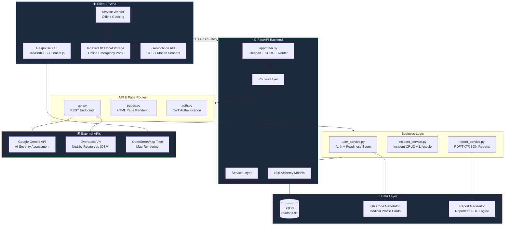
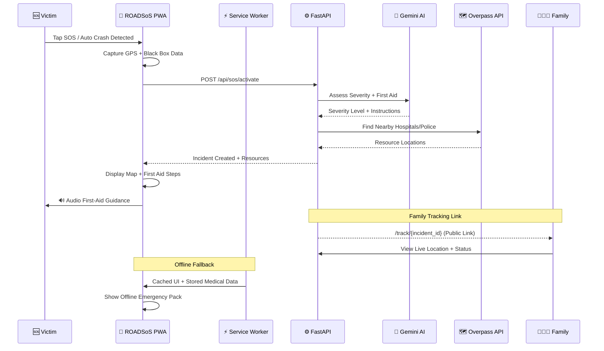

# 🚨 ROADSoS AI — AI-Powered Emergency Response & Disaster Assistance Platform

> **Saving lives during the Golden Hour with AI, real-time geolocation, and offline-first PWA technology.**

ROADSoS AI is a production-ready Progressive Web Application built for a **national-level hackathon**. It provides instant, intelligent emergency assistance to accident victims and disaster-affected communities — even without internet connectivity.

🚀 Live demo: https://roadsos-ai-uhnz.onrender.com/

---

## 🏗️ Architecture Overview



---

## 🔄 Emergency Workflow



---

## ✨ Features

### 🆘 Core Emergency
| Feature | Description |
|---|---|
| **One-Tap SOS** | Instant emergency activation with GPS lock and countdown timer |
| **Auto Crash Detection** | DeviceMotionEvent-based G-force monitoring triggers SOS automatically |
| **AI Severity Assessment** | Gemini AI analyzes the situation and provides a 1-5 severity rating |
| **Audio First Aid** | Text-to-speech reads AI-generated first-aid instructions aloud |
| **Black Box Recorder** | Captures speed, heading, network status, and battery at incident time |

### 🗺️ Maps & Resources
| Feature | Description |
|---|---|
| **Emergency Resource Finder** | Overpass API locates hospitals, police, fire stations within radius |
| **Interactive Leaflet Map** | Color-coded markers for resources; live location tracking |
| **Admin Incident Heatmap** | Leaflet.heat visualization for incident density analysis |

### 👤 User & Medical
| Feature | Description |
|---|---|
| **Medical Profile** | Blood group, allergies, medications, conditions, organ donor status |
| **QR Medical Card** | Scannable QR code with embedded medical profile JSON |
| **Emergency Contacts** | Primary/secondary contacts notified during SOS events |
| **100-Point Readiness Score** | Weighted formula tracking profile completion, QR, contacts, offline pack |

### 📡 Connectivity & Offline
| Feature | Description |
|---|---|
| **PWA (Installable)** | Add to home screen, standalone mode, custom manifest |
| **Service Worker Caching** | All UI assets cached (Tailwind, Leaflet, FontAwesome) for offline use |
| **Offline Emergency Pack** | Medical profile + nearby resources saved to localStorage |
| **Family Tracking Link** | Public `/track/{id}` page — no login required for family to view |

### 🌪️ Disaster Mode
| Feature | Description |
|---|---|
| **Disaster Type Selection** | Flood, Earthquake, Cyclone, Landslide, Fire, Industrial — each with tailored AI |
| **Shelter Finder** | Locates nearby shelters and safe zones via Overpass |
| **Community Reports** | Crowdsourced danger zone and status reporting |

### 📊 Reports & Admin
| Feature | Description |
|---|---|
| **PDF/TXT/JSON Reports** | Full incident reports generated with ReportLab |
| **Admin Dashboard** | User management, incident oversight, heatmap analytics |
| **Incident Timeline** | Complete chronological log of each SOS event lifecycle |

---

## 🗂️ Project Structure

```
ROADSoS_AI/
├── app/
│   ├── main.py                    # FastAPI app, lifespan, routers
│   ├── ai/
│   │   └── gemini_client.py       # Gemini API integration
│   ├── config/
│   │   └── settings.py            # Pydantic settings (.env loader)
│   ├── database/
│   │   └── connection.py          # SQLAlchemy engine + session
│   ├── emergency/
│   │   └── resource_finder.py     # Overpass API hospital/police finder
│   ├── models/
│   │   ├── user.py                # User model + readiness score
│   │   ├── incident.py            # Incident model + lifecycle
│   │   └── medical_profile.py     # Medical profile + contacts
│   ├── routes/
│   │   ├── api.py                 # REST API (SOS, resources, admin)
│   │   ├── auth.py                # Login/register + JWT
│   │   └── pages.py               # HTML page rendering
│   ├── services/
│   │   ├── user_service.py        # Auth helpers + readiness calc
│   │   ├── incident_service.py    # Incident CRUD
│   │   └── report_service.py      # PDF/TXT/JSON generation
│   ├── templates/                 # Jinja2 HTML templates
│   │   ├── base.html              # Layout shell
│   │   ├── index.html             # Landing page
│   │   ├── dashboard.html         # User dashboard
│   │   ├── sos.html               # SOS activation page
│   │   ├── map.html               # Interactive resource map
│   │   ├── admin.html             # Admin panel + heatmap
│   │   ├── track.html             # Public tracking page
│   │   └── ...                    # Profile, reports, disaster, etc.
│   └── utils/
│       └── qr_generator.py        # QR code generation
├── static/
│   ├── js/
│   │   ├── service-worker.js      # PWA offline caching
│   │   └── crash-detection.js     # Auto crash G-force module
│   └── manifest.json              # PWA manifest
├── .env.example                   # Environment variable template
├── Dockerfile                     # Container deployment
├── requirements.txt               # Python dependencies
└── README.md                      # This file
```

---

## 🛠️ Tech Stack

| Layer | Technology |
|---|---|
| **Backend Framework** | FastAPI 0.104+ with async/await |
| **ORM** | SQLAlchemy 2.0 + SQLite |
| **AI Engine** | Google Gemini API (gemini-2.0-flash) |
| **Frontend** | HTML5 + TailwindCSS + Vanilla JavaScript |
| **Maps** | Leaflet.js + OpenStreetMap + Leaflet.heat |
| **Geolocation** | Overpass API (OpenStreetMap) |
| **PDF Generation** | ReportLab |
| **QR Codes** | qrcode + Pillow |
| **Authentication** | JWT (PyJWT) + bcrypt |
| **Deployment** | Docker + Uvicorn |
| **PWA** | Service Worker + Web App Manifest |

---

## 🚀 Quick Start

### Prerequisites
- Python 3.11+
- A [Google Gemini API key](https://aistudio.google.com/apikey)

### 1. Clone & Install
```bash
git clone https://github.com/your-username/ROADSoS_AI.git
cd ROADSoS_AI
python -m venv venv
source venv/bin/activate       # Windows: venv\Scripts\activate
pip install -r requirements.txt
```

### 2. Configure Environment
```bash
cp .env.example .env
# Edit .env and add your GEMINI_API_KEY
```

### 3. Run
```bash
uvicorn app.main:app --reload
# Open http://localhost:8000
```

### 4. Demo Credentials
```
Email:    demo@roadsos.ai
Password: demo1234
```

### 5. Docker (Optional)
```bash
docker build -t roadsos-ai .
docker run -p 8000:8000 --env-file .env roadsos-ai
```

---

## 📸 Screenshots

See the [`demo/`](./demo/) folder for full application screenshots.

---

## 🏆 Hackathon Highlights

- **Golden Hour Focus**: Designed to maximize survival chances in the critical first 60 minutes after an accident
- **Works Offline**: Full PWA with cached UI and stored medical data — works even without internet
- **AI-Powered**: Gemini AI provides real-time severity assessment and first-aid guidance
- **Privacy-First**: All data stored locally in SQLite; no third-party analytics
- **Auto Detection**: Accelerometer-based crash detection — no manual SOS needed
- **Family Peace of Mind**: Shareable tracking links let family follow the incident in real-time

---

## 📄 License

MIT License — Built with ❤️ for saving lives.
