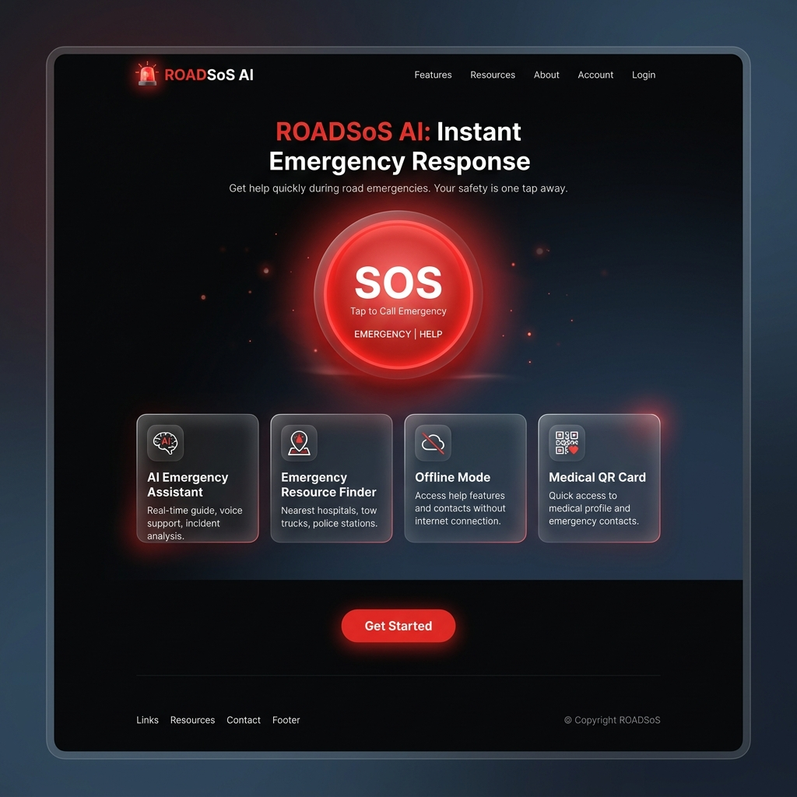
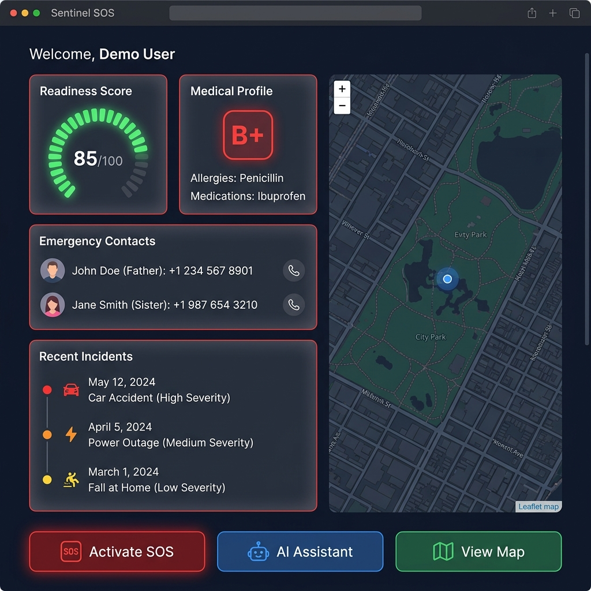
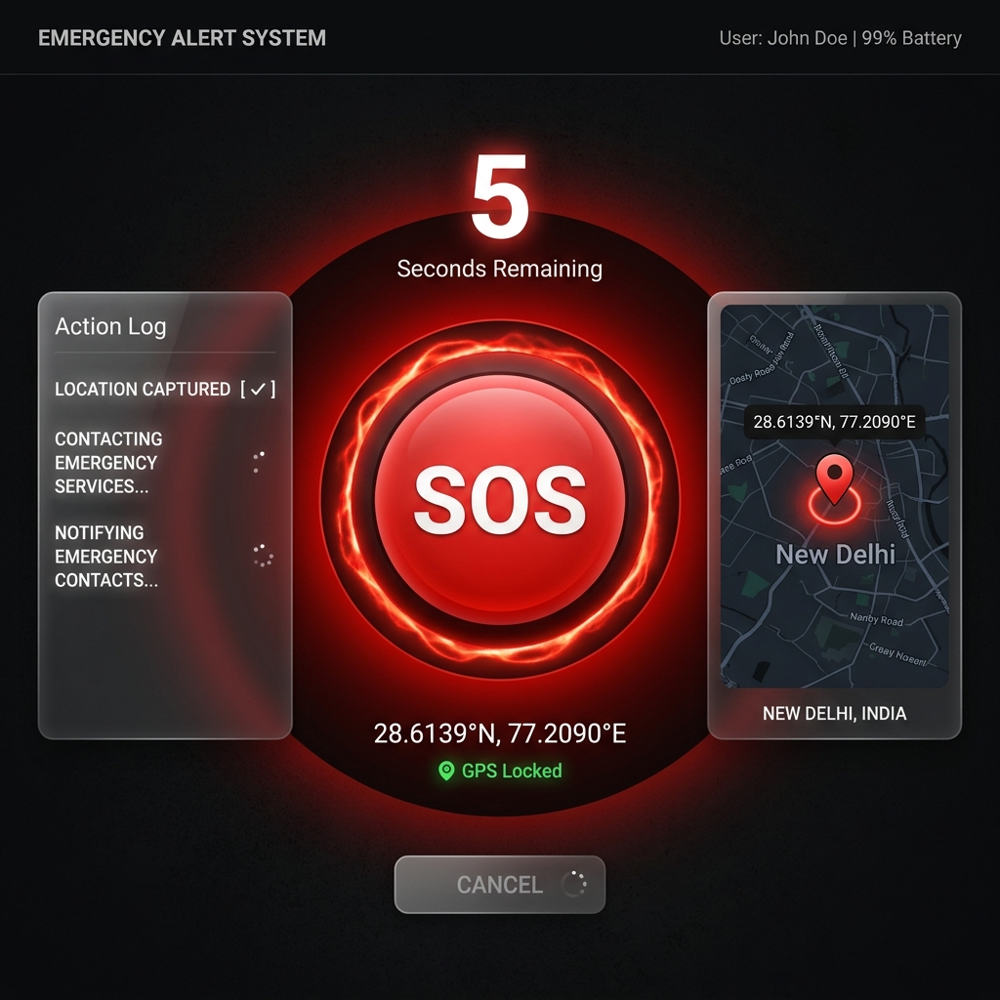
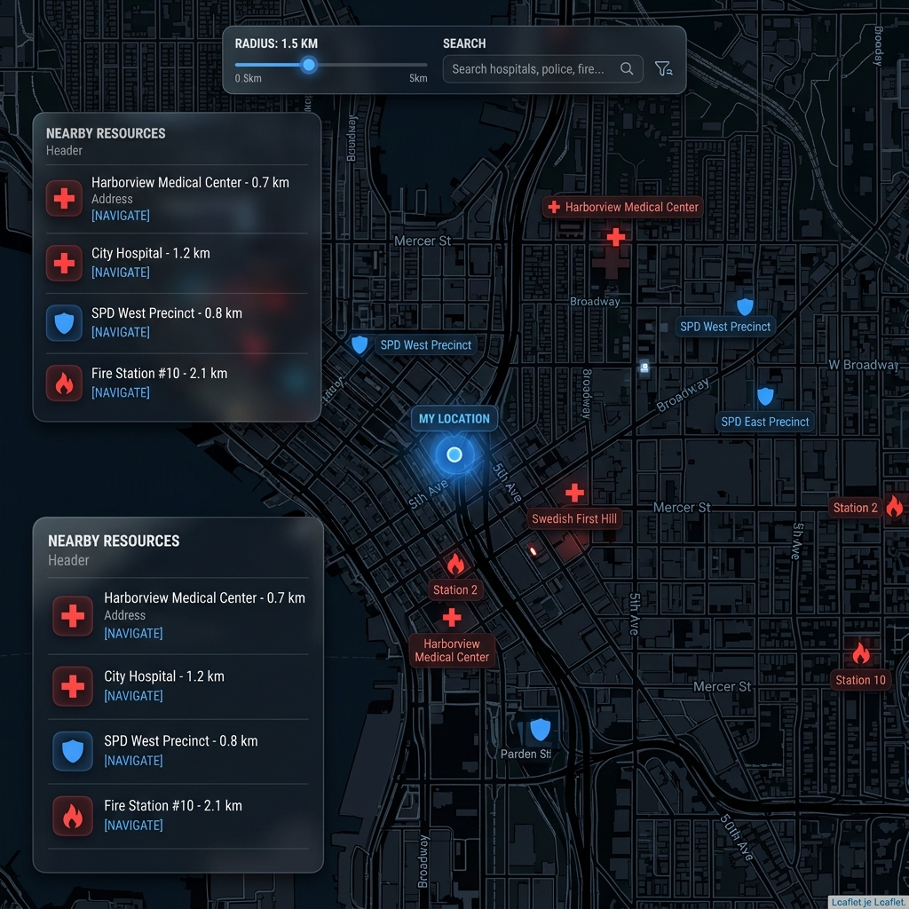
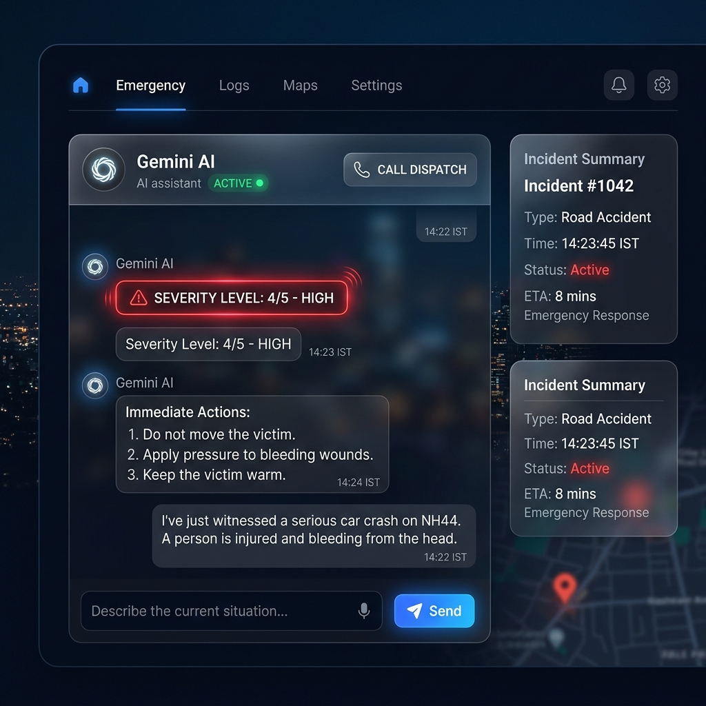
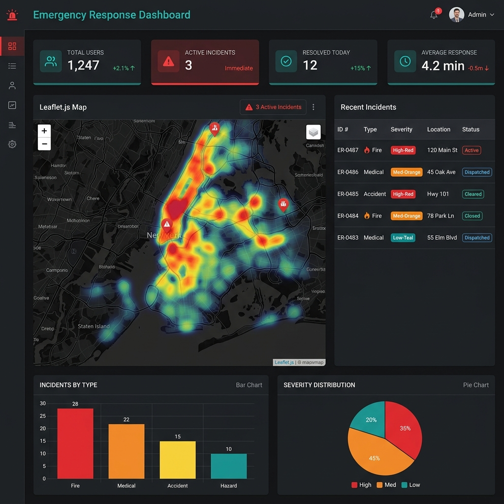

# ROADSoS AI — Demo Screenshots

## Application Screens

### 1. Landing Page

The main entry point with hero section, feature highlights, and one-tap SOS access.

---

### 2. User Dashboard

Personalized dashboard showing readiness score, medical profile summary, emergency contacts, and recent incidents.

---

### 3. SOS Activation

Emergency activation screen with countdown timer, GPS lock indicator, and real-time status updates.

---

### 4. Emergency Resource Map

Interactive Leaflet.js map showing nearby hospitals, police stations, and fire stations with distance indicators.

---

### 5. AI Emergency Assistant

Gemini AI-powered chat interface providing severity assessment and step-by-step first-aid instructions.

---

### 6. Admin Dashboard & Heatmap

Administrative overview with incident metrics, heatmap visualization, and recent incident management table.

---

## Demo Credentials
```
Email:    demo@roadsos.ai
Password: demo1234
```

## Running Locally
```bash
uvicorn app.main:app --reload
# Open http://localhost:8000
```
